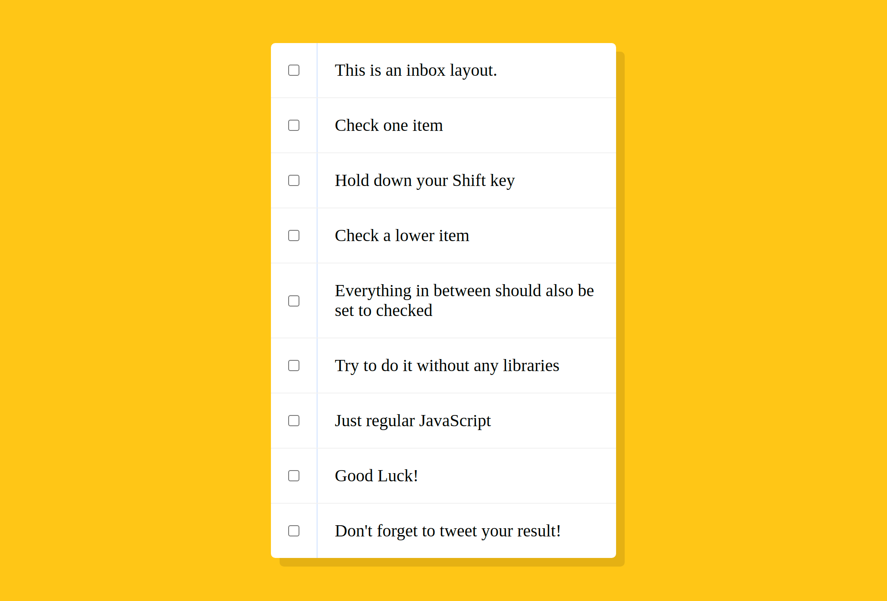

# 10-Hold-Shift-and-Checkboxes

## Project Link

https://puthpiseth.github.io/10-Hold-Shift-and-Checkboxes/index-START.html

## Guides

Quand une case à cocher est sélectionnée, le texte du paragraphe apparaîtra barré.
L'effet net est de fournir une opération de sélection multiple après avoir appuyé sur la touche Maj.

## Project Layout

